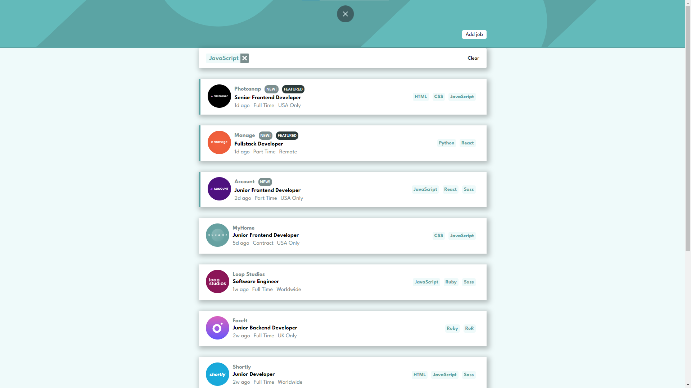

# Job Listing


**WARNING!**

This project in not finished yet. This site is under development

___

## **How to start locally**
### **1. Download local Server**
 For using  this project on your laptop or computer you need do download local server.

 One of free local servers: **[Open Server](https://ospanel.io/)** or **[Mamp](https://www.mamp.info/en/windows/)**


### **2. Set up settings**
Go to folder where you installed local server , and open ```Domains``` folder

Clone this project using 
```sh
git clone https://github.com/Abdugafor/job-listing.git
```

### **3. Download json-server**
 Open terminal on your code editor and run this command:

 ```sh
npm install json-server
```
and **run**
``` 
npx json-server data.json
```


___
## Screenshot


